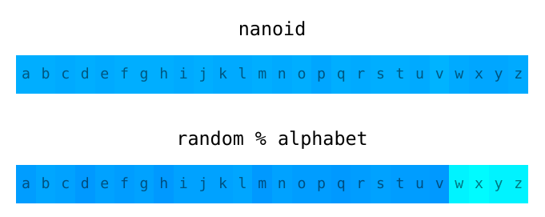

# Nano ID
# nanoid


> 日本語のREADMEはこちらです: [README.ja.md](README.ja.md)

**English** | [Русский](./README.ru.md) | [简体中文](./README.zh-CN.md) | [Bahasa Indonesia](./README.id-ID.md)
A tiny, secure, URL-friendly, unique string ID generator for JavaScript.

A tiny, secure, URL-friendly, unique string ID generator for JavaScript.
## Features

> “An amazing level of senseless perfectionism,
> which is simply impossible not to respect.”

* **Small.** 130 bytes (minified and gzipped). No dependencies.
* **Small.** 130 bytes (minified and gzipped). No dependencies.
  [Size Limit] controls the size.
* **Safe.** It uses hardware random generator. Can be used in clusters.
* **Short IDs.** It uses a larger alphabet than UUID (`A-Za-z0-9_-`).
  So ID size was reduced from 36 to 21 symbols.
* **Short IDs.** It uses a larger alphabet than UUID (`A-Za-z0-9_-`).
  So ID size was reduced from 36 to 21 symbols.
* **Portable.** Nano ID was ported
  to [20 programming languages](./README.md#other-programming-languages).

## Usage

```js
import { nanoid } from 'nanoid'
model.id = nanoid() //=> "V1StGXR8_Z5jdHi6B-myT"
```

Supports modern browsers, IE [with Babel], Node.js and React Native.

[online tool]: https://gitpod.io/#https://github.com/ai/nanoid/
[with Babel]:  https://developer.epages.com/blog/coding/how-to-transpile-node-modules-with-babel-and-webpack-in-a-monorepo/
[Size Limit]:  https://github.com/ai/size-limit

<a href="https://evilmartians.com/?utm_source=nanoid">
  
</a>

## Table of Contents

* [Comparison with UUID](#comparison-with-uuid)
* [Benchmark](#benchmark)
* [Security](#security)
* [API](#api)
  * [Blocking](#blocking)
  * [Async](#async)
  * [Non-Secure](#non-secure)
  * [Custom Alphabet or Size](#custom-alphabet-or-size)
  * [Custom Random Bytes Generator](#custom-random-bytes-generator)
* [Usage](#usage)
  * [React](#react)
  * [React Native](#react-native)
  * [PouchDB and CouchDB](#pouchdb-and-couchdb)
  * [Web Workers](#web-workers)
  * [Jest](#jest)
  * [CLI](#cli)
  * [Other Programming Languages](#other-programming-languages)
* [Tools](#tools)

## Comparison with UUID

Nano ID is quite comparable to UUID v4 (random-based).
It has a similar number of random bits in the ID
(126 in Nano ID and 122 in UUID), so it has a similar collision probability:

> For there to be a one in a billion chance of duplication,
> 103 trillion version 4 IDs must be generated.

There are two main differences between Nano ID and UUID v4:

1. Nano ID uses a bigger alphabet, so a similar number of random bits
   are packed in just 21 symbols instead of 36.
2. Nano ID code is **4 times smaller** than `uuid/v4` package:
   130 bytes instead of 423.

## Benchmark

```rust
$ node ./test/benchmark.js
crypto.randomUUID         21,119,429 ops/sec
uuid v4                   20,368,447 ops/sec
@napi-rs/uuid             11,493,890 ops/sec
uid/secure                 8,409,962 ops/sec
@lukeed/uuid               6,871,405 ops/sec
nanoid                     5,652,148 ops/sec
customAlphabet             3,565,656 ops/sec
secure-random-string         394,201 ops/sec
uid-safe.sync                393,176 ops/sec
shortid                       49,916 ops/sec

Async:
nanoid/async                 135,260 ops/sec
async customAlphabet         136,059 ops/sec
async secure-random-string   135,213 ops/sec
uid-safe                     119,587 ops/sec

Non-secure:
uid                       58,860,241 ops/sec
nanoid/non-secure          2,744,615 ops/sec
rndm                       2,718,063 ops/sec
```

Test configuration: ThinkPad X1 Carbon Gen 9, Fedora 36, Node.js 18.9.

## Security

*See a good article about random generators theory:
[Secure random values (in Node.js)]*

* **Unpredictability.** Instead of using the unsafe `Math.random()`, Nano ID
  uses the `crypto` module in Node.js and the Web Crypto API in browsers.
  These modules use unpredictable hardware random generator.
* **Uniformity.** `random % alphabet` is a popular mistake to make when coding
  an ID generator. The distribution will not be even; there will be a lower
  chance for some symbols to appear compared to others. So, it will reduce
  the number of tries when brute-forcing. Nano ID uses a [better algorithm]
  and is tested for uniformity.

  

* **Well-documented:** all Nano ID hacks are documented. See comments
  in [the source].
* **Vulnerabilities:** to report a security vulnerability, please use
  the [Tidelift security contact](https://tidelift.com/security).
  Tidelift will coordinate the fix and disclosure.

[Secure random values (in Node.js)]: https://gist.github.com/joepie91/7105003c3b26e65efcea63f3db82dfba
[better algorithm]:                  https://github.com/ai/nanoid/blob/main/index.js
[the source]:                        https://github.com/ai/nanoid/blob/main/index.js

## Install

```bash
npm install --save nanoid
```

Nano ID 4 works only with ESM projects in tests or Node.js scripts.
For CommonJS you need Nano ID 3.x (we still support it):

```bash
npm install --save nanoid@3
```

For quick hacks, you can load Nano ID from CDN. Though, it is not recommended
to be used in production because of the lower loading performance.

```js
import { nanoid } from 'https://code4fukui.github.io/nanoid/nanoid.js'
```

Nano ID provides ES modules. You do not need to do anything to use Nano ID
as ESM in webpack, Rollup, Parcel, or Node.js.

```js
import { nanoid } from 'nanoid'
```

## API

Nano ID has 3 APIs: normal (blocking), asynchronous, and non-secure.

By default, Nano ID uses URL-friendly symbols (`A-Za-z0-9_-`) and returns an ID
with 21 characters (to have a collision probability similar to UUID v4).

### Blocking

The safe and easiest way to use Nano ID.

In rare cases could block CPU from other work while noise collection
for hardware random generator.

```js
import { nanoid } from 'nanoid'
model.id = nanoid() //=> "V1StGXR8_Z5jdHi6B-myT"
```

If you want to reduce the ID size (and increase collisions probability),
you can pass the size as an argument.

```js
nanoid(10) //=> "IRFa-VaY2b"
```

Don’t forget to check the safety of your ID size
in our [ID collision probability] calculator.

You can also use a [custom alphabet](#custom-alphabet-or-size)
or a [random generator](#custom-random-bytes-generator).

[ID collision probability]: https://zelark.github.io/nano-id-cc/

### Async

To generate hardware random bytes, CPU collects electromagnetic noise.
For most cases, entropy will be already collected.

In the synchronous API during the noise collection, the CPU is busy and
cannot do anything useful (for instance, process another HTTP request).

Using the asynchronous API of Nano ID, another code can run during
Using the asynchronous API, another code can run during
the entropy collection.

```js
import { nanoid } from 'nanoid/async'

async function createUser() {
  user.id = await nanoid()
}
```

Read more about entropy collection in [`crypto.randomBytes`] docs.

Unfortunately, you will lose Web Crypto API advantages in a browser
if you use the asynchronous API. So, currently, in the browser, you are limited
with either security (`nanoid`), asynchronous behavior (`nanoid/async`),
or non-secure behavior (`nanoid/non-secure`) that will be explained
in the next part of the documentation.

[`crypto.randomBytes`]: https://nodejs.org/api/crypto.html#crypto_crypto_randombytes_size_callback

### Non-Secure

By default, Nano ID uses hardware random bytes generation for security
and low collision probability. If you are not so concerned with security,
If you are not so concerned with security,
you can use the faster non-secure generator.

```js
import { nanoid } from 'nanoid/non-secure'
const id = nanoid() //=> "Uakgb_J5m9g-0JDMbcJqLJ"
```

## Other Programming Languages

### Custom Alphabet or Size
Nano ID has been ported to [20 programming languages](./README.md#other-programming-languages).

`customAlphabet` returns a function that allows you to create `nanoid`
with your own alphabet and ID size.

## License
This project is licensed under the [MIT License](LICENSE).
